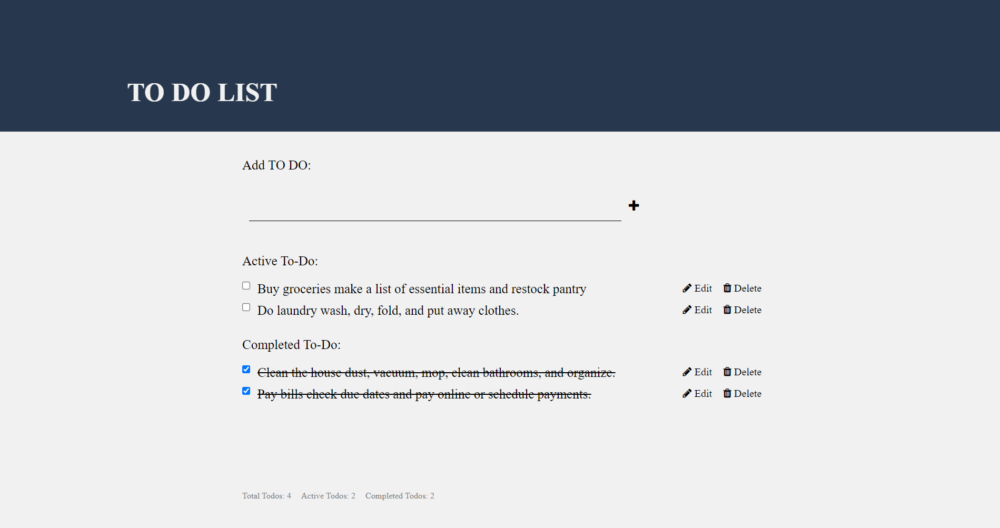

# Todo App

This project aims to build a to do list application by applying HTML, CSS and Javascript.  The application allows users to manage their tasks effectively.

## Built With

  
  
  
  
  
  
  

## Demo

## Featuers
-  Adding a Todo
-  Rendering Todo List
-  Completing a Todo
-  leting a Todo
-  Editing a Todo
-  Todo Counter
-  Prsistent Storage

